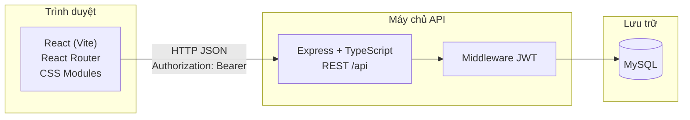
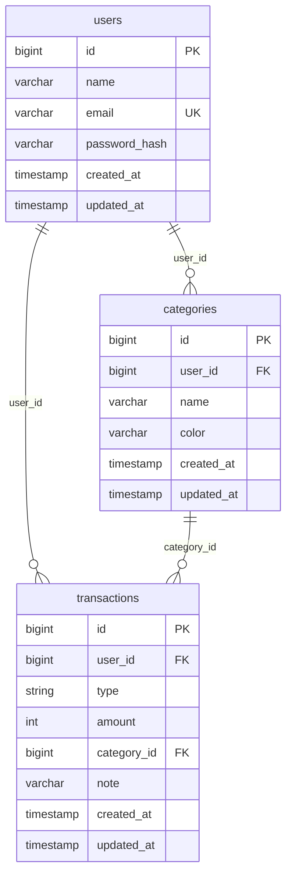
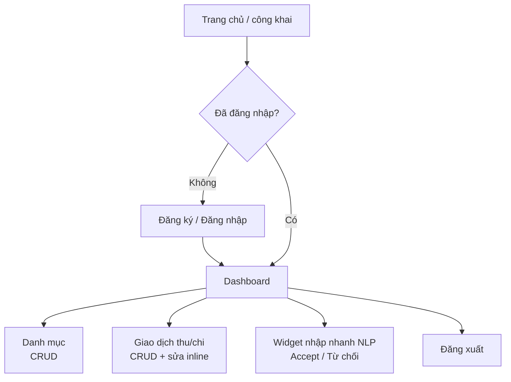
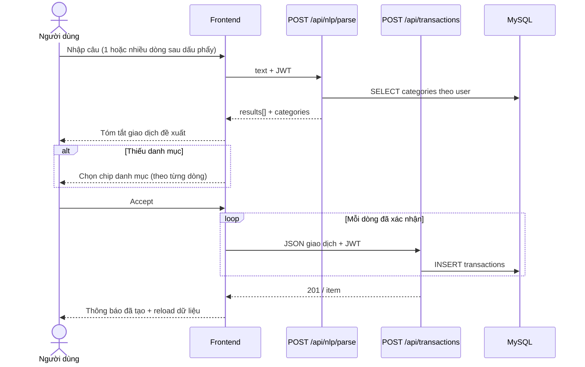
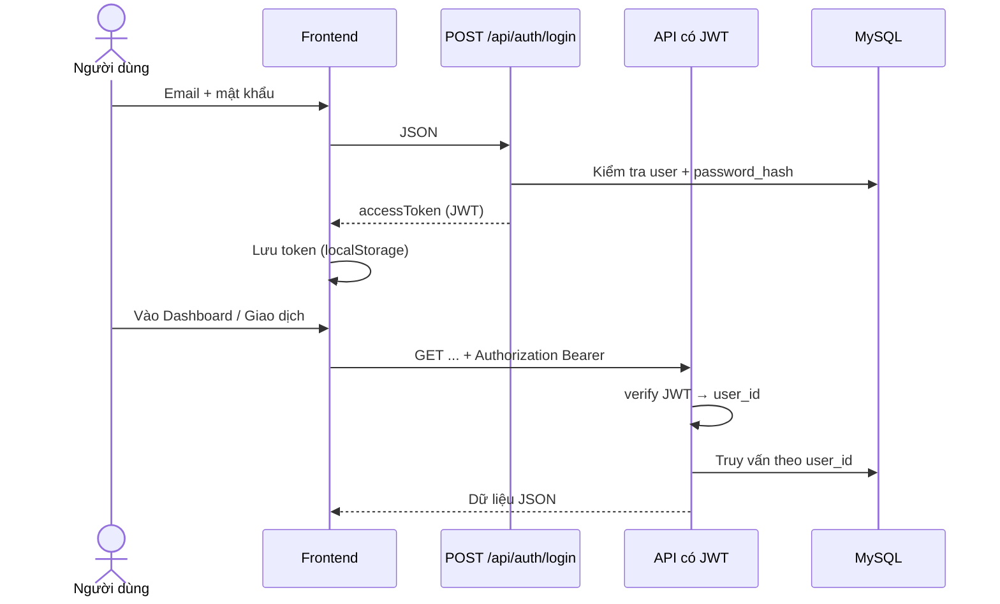

# JOB.md — Kế hoạch 3 tuần (React FE + Node.js API)

Mục tiêu: Hoàn thành MVP hệ thống **quản lý tài chính cá nhân** theo `docs.txt`:

- Auth (đăng ký/đăng nhập)
- Thu/chi (CRUD) + danh mục
- Thống kê cơ bản (tổng thu/tổng chi/số dư + biểu đồ)
- AI/NLP: nhập liệu ngôn ngữ tự nhiên + chatbot hỏi đáp (OpenAI/Gemini)

Nguyên tắc triển khai:

- FE: React (Vite) + UI component library (tuỳ chọn).
- API: Node.js (Express + TypeScript) + MySQL + JWT Auth.
- Mỗi tuần **2 commit để push** (Commit A giữa tuần, Commit B cuối tuần).

---

## Tuần 1 — Khởi tạo dự án + Auth nền tảng

### Commit A (giữa tuần): Scaffold + chuẩn hoá cấu trúc

- [x] Tạo cấu trúc repo (FE/BE tách thư mục), README hướng dẫn chạy. (done)
- [x] Cập nhật `docs.txt` theo đề tài quản lý tài chính + AI/NLP. (done)
- [x] Cập nhật `hoangtrieu-finance-manager/README.md` theo format báo cáo trong `RULE_LAM_VIEC.md`. (done)
- [x] FE React (Vite): scaffold project. (done)
- [x] BE Node.js (Express + TS): project skeleton, CORS, healthcheck `/health`. (done)
- [x] Thêm `.gitignore` cho folder `hoangtrieu-finance-manager/`. (done)

#### Gợi ý message
- `chore: khởi tạo cấu trúc FE React và API Node.js`

### Commit B (cuối tuần): Làm giao diện trước (hard-code data)

- [x] FE: dựng UI theo main flow (chưa cần API): (done)
  - [x] Trang Login/Register (UI) (done)
  - [x] Trang Danh mục (UI CRUD với data hard-code) (done)
  - [x] Trang Giao dịch thu/chi (UI CRUD với data hard-code) (done)
  - [x] Trang Dashboard thống kê (UI + biểu đồ mẫu với data hard-code) (done)
- [x] FE: cấu trúc routing, layout, component dùng lại, state tạm (mock data). (done)
- [x] FE: tách component chung để tránh trùng UI (Button/Input/Card, AppShell layout). (done)
- [x] FE: thống nhất theme/UI: (done)
  - Màu chủ đạo: **Xanh dương** (primary) + **xám trung tính** (background/text)
  - Button/link dùng 1 style; form input có trạng thái focus/error rõ ràng
  - Tối ưu main flow: đăng nhập → giao dịch → thống kê
- [x] BE: giữ `GET /health` để kiểm tra server chạy (chưa cần auth/DB). (done)

#### Gợi ý message
- `feat: làm giao diện main flow với dữ liệu hard-code`

---

## Tuần 2 — Làm API (User/Auth + Danh mục + Thu/chi) và nối vào UI

### Commit A (giữa tuần): User/Auth API + Danh mục API

- BE: User model, register/login, JWT access token, middleware bảo vệ route.
- BE: CRUD danh mục theo user.
- FE: nối trang Login/Register + trang Danh mục vào API (thay hard-code).

#### Gợi ý message
- `feat: làm API auth và CRUD danh mục, nối vào giao diện`

### Commit B (cuối tuần): Giao dịch thu/chi API + nối UI

- BE: Transaction model + CRUD (income/expense), validate dữ liệu, filter theo thời gian/danh mục.
- FE: nối màn hình giao dịch (list/form CRUD/filter) vào API (thay hard-code).

#### Gợi ý message
- `feat: làm API giao dịch thu/chi và nối vào giao diện`

---

## Tuần 3 — Thống kê + AI/NLP + hoàn thiện nộp

### Commit A (giữa tuần): Thống kê + NLP quick-add (MVP)

- BE: endpoint thống kê cơ bản:
  - Tổng thu / tổng chi / số dư theo khoảng thời gian
  - Aggregation theo ngày/tuần/tháng (tuỳ 1 lựa chọn)
  - Breakdown theo danh mục (top categories)
- BE: endpoint NLP nhận text, parse ra {type, amount, category, note, date} (MVP rule-based).
- FE: dashboard số liệu (cards) + biểu đồ thu/chi (Chart.js/Recharts tuỳ chọn) + bộ lọc thời gian.
- FE: ô nhập nhanh “Hôm nay chi 50k ăn sáng”, preview kết quả parse, bấm “Tạo giao dịch”.

#### Gợi ý message
- `feat: làm dashboard thống kê và nhập nhanh bằng NLP`

### Commit B (cuối tuần): Chatbot OpenAI/Gemini + chốt tài liệu

- BE: chatbot endpoint (OpenAI/Gemini) có context từ dữ liệu user (tóm tắt theo thời gian/danh mục).
- FE: trang Chat, lịch sử chat (tối thiểu theo phiên).
- Hoàn thiện UX: loading/error states, empty states.
- Chốt README: hướng dẫn chạy FE/BE, biến môi trường, demo flow.

#### Gợi ý message
- `feat: tích hợp chatbot hỏi đáp tài chính và hoàn thiện tài liệu`

---

## Checklist bàn giao (cuối tuần 3)

- FE chạy được: login → tạo danh mục → tạo giao dịch → xem dashboard → NLP quick-add → chatbot.
- BE có OpenAPI docs, endpoint rõ ràng, auth bảo vệ dữ liệu theo user.
- README có:
  - Cách chạy local FE/BE
  - Env keys (OpenAI/Gemini nếu có)
  - Test data/demo account (nếu dùng)

---

## Phụ lục: Biểu đồ phục vụ mục 3.5 (Thiết kế hệ thống)

Các sơ đồ dưới đây viết bằng **Mermaid** (khối ` ```mermaid ` … ` ``` `). Khi làm báo cáo Word/PDF:

- Xem trước trong **GitHub**, **Cursor** (preview Markdown), hoặc [mermaid.live](https://mermaid.live) rồi **xuất PNG/SVG** dán vào mục **Hình …** tương ứng.
- Nội dung bám **code hiện tại** (React + Express + MySQL + JWT + NLP rule-based).

**Preview trong Cursor bị mờ:** thường do **thu nhỏ** sơ đồ trong khung preview hoặc **zoom** editor thấp. Thử: **Ctrl +** (phóng to cửa sổ), kéo **rộng** panel Preview; hoặc copy nguyên khối `mermaid` sang **[mermaid.live](https://mermaid.live)** → **Actions → SVG/PNG** (SVG nét nhất khi dán Word). Không cần sửa nội dung sơ đồ trong repo.

### Hình A — Kiến trúc tổng thể (client–server)



### Hình B — ERD (quan hệ bảng)



### Hình C — Luồng người dùng chính (tổng quan)



### Hình D — Luồng nhập nhanh NLP → tạo giao dịch



### Hình E — Luồng đăng nhập và gọi API có bảo vệ



